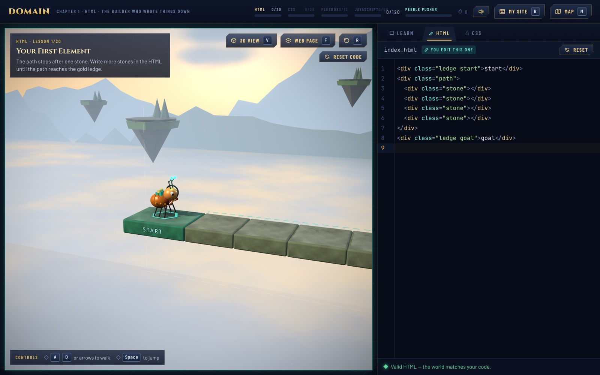
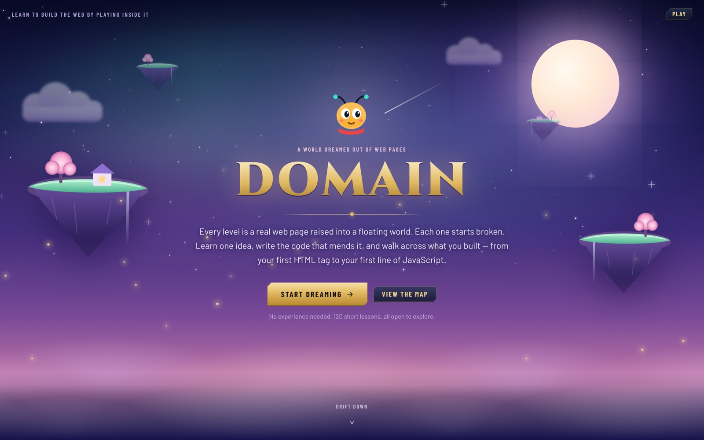
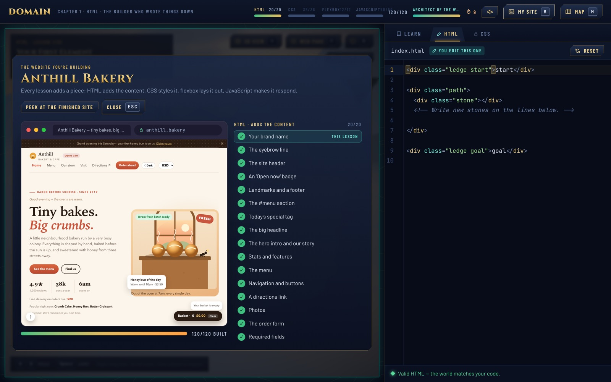
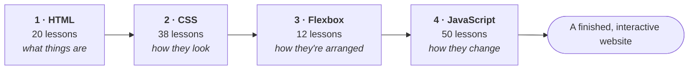
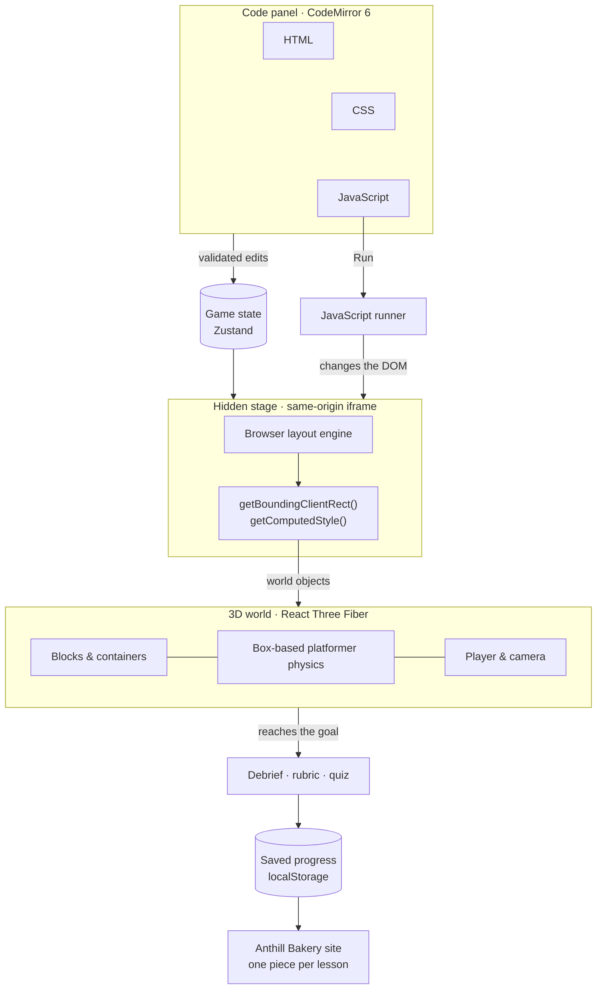
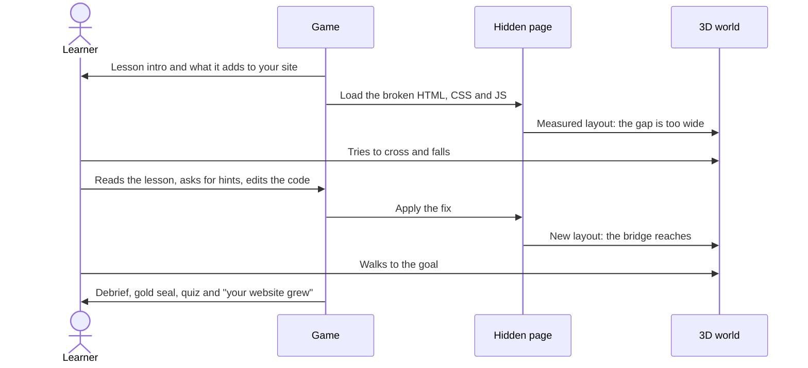
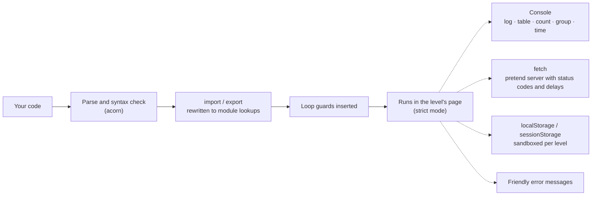
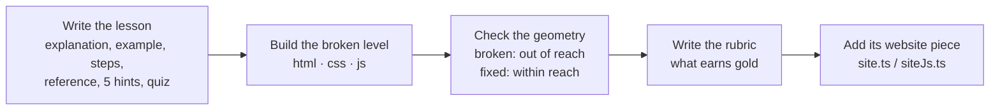

<div align="center">

# DOMAIN

### Learn to build the web by playing inside it.

A 3D platformer where every level is a real web page. Fix the HTML, CSS or JavaScript, and walk across what you built.

### [▶ Play it now](https://domain-indol-nine.vercel.app)


<br>



</div>

---

## Contents

- [Overview](#overview)
- [Screenshots](#screenshots)
- [The course](#the-course)
- [How it works](#how-it-works)
- [Tech stack](#tech-stack)
- [Getting started](#getting-started)
- [Controls](#controls)
- [Project structure](#project-structure)
- [Adding a lesson](#adding-a-lesson)
- [License](#license)

## Overview

DOMAIN teaches web development from zero by turning code into terrain.

Each level is a genuine HTML document. The browser lays it out, the game measures every element, and each one becomes a block in a floating 3D world. Every level starts **broken**: a bridge too short, a gate that won't open, stairs built in the wrong order. You learn one idea, change the code, and the world rebuilds so you can cross it.

As you finish lessons you also build a real website, the **Anthill Bakery**. It starts as a blank page. HTML gives it content, CSS gives it style, Flexbox arranges it, and JavaScript makes it interactive, one piece per lesson.

**Highlights**

- **120 lessons** across HTML, CSS, Flexbox and JavaScript, each with an explanation, annotated example, steps, a reference card, five progressive hints, a debrief and a quiz.
- **The real browser is the rules engine.** CSS is never simulated: if the browser renders it, the world matches it.
- **JavaScript runs for real**, with loop guards, beginner-friendly errors, a console, modules, a pretend server for `fetch`, and sandboxed storage.
- **A website that grows with you**, shown after every lesson as a before-and-after reveal.
- **It feels like a game:** dust and confetti, a level-clear celebration, XP, eight builder ranks and a daily streak — and the world tells you the moment your code makes the goal reachable.
- **In-world DevTools:** click any block to inspect its element, box, CSS rules and event listeners, or press **F** to see the flat page.

## Screenshots

<table>
<tr>
<td width="50%"><br><em>Every course starts somewhere. This one starts in the clouds.</em></td>
<td width="50%"><br><em>The website you build, one piece per lesson.</em></td>
</tr>
</table>

## The course



| Chapter | Lessons | Topics |
| --- | :---: | --- |
| **HTML** | 20 | Elements, attributes, nesting, `div`/`span`, semantic sections, `id`/`class`, `data-*`, headings, paragraphs, emphasis, lists, links, `target`/`rel`, images, forms, validation, tables, the `<head>`, alt text |
| **CSS** | 38 | Selectors and combinators, pseudo-classes and pseudo-elements, specificity, inheritance, `!important`, the box model, units, `calc`/`clamp`, colour, positioning, `z-index`, overflow, Grid, backgrounds, shadows, gradients, typography, custom properties, transitions |
| **Flexbox** | 12 | Container vs item, `display: flex`, direction, wrap, `justify-content`, `align-items`, `align-content`, `gap`, grow/shrink/basis, `align-self`/`order`, the `min-width: auto` gotcha, patterns and when to use Grid |
| **JavaScript** | 50 | `let`/`const`, types, references, equality and truthiness, template literals, operators, control flow, loops, functions, hoisting, scope, closures, `this`, callbacks, arrays, objects, JSON, the DOM, events, delegation, timers, promises, `async`/`await`, `Promise.all`, `fetch`, loading and error states, modules, storage, debugging, classes, `Map`/`Set`, regex, dates, strict mode |

## How it works

### Architecture



1. **You edit code.** HTML and CSS are checked as you type, and invalid code never reaches the world, so a half-typed line can't break it.
2. **The browser lays out the page** inside a hidden iframe fixed at 900 × 520 px.
3. **Every element is measured** and becomes a world object. Elements with no child elements are solid, walkable blocks; elements with children are drawn as translucent frames.
4. **The 3D scene and physics** read those same objects, so what you see, what you stand on and what the code says always agree.
5. **Reaching the goal** runs the lesson's rubric for a gold seal, saves your progress, and adds that lesson's piece to your website.

### The lesson loop



Every level is designed around the character's measured reach, **about 200 px across and 100 px up**. A broken layout is always clearly out of reach and a fixed one clearly within it, so your code decides the outcome, not your timing.

### The JavaScript runner



- **Loop guards** stop runaway loops after 10,000 turns and explain why, instead of freezing the tab.
- **Modules:** lessons can ship their own module files, and `import`/`export` work between them.
- **`fetch`** talks to a small pretend server defined by the level. Requests really wait, return real `Response` objects, and can fail with `400`, `404` or `503`, which is enough to teach loading and error states properly.
- **Storage** is isolated per level and never touches the game's own saved progress.
- **Errors** are translated into plain language, like “Tried to use `.forEach` on nothing (`null`)”, with a hint about the likely cause.

## Tech stack

| Layer | Technology | Used for |
| --- | --- | --- |
| **Framework** | [Next.js](https://nextjs.org) 16 (App Router, Turbopack) | Routing, the landing page and `/play`, production builds |
| **UI** | [React](https://react.dev) 19 | Every screen, panel and overlay |
| **Language** | [TypeScript](https://www.typescriptlang.org) 5 | The whole codebase, including the lesson data |
| **3D rendering** | [Three.js](https://threejs.org) r186 · [React Three Fiber](https://r3f.docs.pmnd.rs) 9 · [drei](https://github.com/pmndrs/drei) 10 | The floating world: blocks, sky, mountain ridges, clouds and islands |
| **Post-processing** | [@react-three/postprocessing](https://github.com/pmndrs/react-postprocessing) 3 | Bloom, ambient occlusion (N8AO), anti-aliasing (SMAA) and vignette |
| **Physics** | Custom box-based platformer controller | Movement, jumping and collisions against the measured page boxes |
| **Code editor** | [CodeMirror](https://codemirror.net) 6 via `@uiw/react-codemirror` | HTML, CSS and JavaScript editing, syntax highlighting, inline errors |
| **JavaScript parsing** | [acorn](https://github.com/acornjs/acorn) · acorn-walk | Syntax checking, loop guards, module rewriting |
| **HTML & CSS checks** | Custom parsers (`htmlParse.ts`, `cssParse.ts`) | Beginner-friendly validation and the lesson rubrics |
| **State** | [Zustand](https://zustand.docs.pmnd.rs) 5 (`persist` middleware) | Game state and saved progress in `localStorage` |
| **Styling** | [Tailwind CSS](https://tailwindcss.com) 4 | Interface styling, theme tokens, the landing page |
| **Fonts** | `next/font` with Google Fonts | Cinzel, Barlow, Barlow Condensed, JetBrains Mono |
| **Audio** | Web Audio API | Procedural sound effects, with no audio files |
| **Textures** | Canvas 2D | Procedurally drawn surface textures, with no image files |
| **Quality** | ESLint 9 (`eslint-config-next`) | Linting |

**Browser APIs the game relies on:** `getBoundingClientRect`, `getComputedStyle`, `MutationObserver`, `ResizeObserver`, `structuredClone`, and the Fetch `Response` object.

## Getting started

Play the deployed game at **[domain-indol-nine.vercel.app](https://domain-indol-nine.vercel.app)** — nothing to install. To run it yourself:

**Requirements:** Node.js 20.9 or newer, and npm.

```bash
git clone https://github.com/shreyascode11/Domain.git
cd Domain
npm install
npm run dev
```

Open <http://localhost:3000> and choose **Start dreaming**, or go straight to `/play`.

| Command | What it does |
| --- | --- |
| `npm run dev` | Start the development server |
| `npm run build` | Create a production build |
| `npm run start` | Serve the production build |
| `npm run lint` | Run ESLint |

> **Tip for development:** lessons unlock in order. To open them all while working on the game, set `UNLOCK_ALL_LEVELS` to `true` in `lib/store.ts`.

## Controls

| Input | Action |
| --- | --- |
| <kbd>A</kbd> <kbd>D</kbd> or <kbd>←</kbd> <kbd>→</kbd> | Move |
| <kbd>Space</kbd> | Jump |
| <kbd>V</kbd> | Switch between 3D and side view |
| <kbd>F</kbd> | Show the flat web page |
| <kbd>R</kbd> | Respawn at the start |
| <kbd>M</kbd> | World map |
| <kbd>B</kbd> | The website you're building |
| <kbd>Ctrl</kbd>/<kbd>⌘</kbd> + <kbd>Enter</kbd> | Run JavaScript |
| Right-drag · scroll | Look around · zoom |
| Click a block | Inspect it like DevTools |

## Project structure

```
Domain/
├── app/
│   ├── layout.tsx            Fonts and the root layout
│   ├── page.tsx              Landing page
│   ├── play/page.tsx         The game
│   └── globals.css           Theme tokens and shared styles
├── components/
│   ├── PlayClient.tsx        The game screen: world, panels, shortcuts
│   ├── HiddenStage.tsx       The iframe page the world is measured from
│   ├── Scene3D.tsx           Sky, ridges, clouds, islands and post-processing
│   ├── Platform.tsx          Blocks and container frames
│   ├── Player.tsx            Character, camera and controls
│   ├── CodePanel.tsx         Learn / HTML / CSS / JS tabs and the console
│   ├── LessonPanel.tsx       Lesson content and hints
│   ├── Inspector.tsx         In-world DevTools
│   ├── Overlays.tsx          Intro, debrief, quiz, map, chapter complete
│   ├── SiteBuild.tsx         "Your website grew", My Site, landing showcase
│   ├── SitePreview.tsx       The browser-window site preview
│   ├── TitleScreen.tsx       Landing page (with DreamSky.tsx)
│   └── WorldMap.tsx          The course map
├── lib/
│   ├── levels.ts             Chapters, plus the HTML, CSS and Flexbox lessons
│   ├── jsLevels/             The 50 JavaScript lessons and their world kit
│   ├── jsRun.ts              The JavaScript runner
│   ├── layout.ts · stage.ts  Measured elements → world objects
│   ├── physics.ts            Platformer controller and reach constants
│   ├── htmlParse.ts · cssParse.ts   Validation and rubric helpers
│   ├── site.ts · siteJs.ts   The Anthill Bakery site, one piece per lesson
│   ├── store.ts              Game state and saved progress
│   └── audio.ts · textures.ts · biomes.ts   Sound, textures, chapter palettes
└── hooks/                    Keyboard input
```

## Adding a lesson

A lesson is a single object in `lib/levels.ts`, or in `lib/jsLevels/` for JavaScript.



| Field | Purpose |
| --- | --- |
| `lesson`, `example`, `steps`, `reference` | What the learner reads |
| `hints` | Five rungs: notice, question, narrow, re-teach, reveal |
| `debrief`, `quiz` | The takeaway and a check for understanding |
| `html`, `css`, `js`, `edit` | The starting files, and which one the learner edits |
| `rubric` | Decides whether the solution earns the gold seal |
| `modules`, `api`, `storage` | Optional extras for JavaScript lessons |

## License

© 2026 Shreyas. All rights reserved. See [LICENSE](LICENSE).
